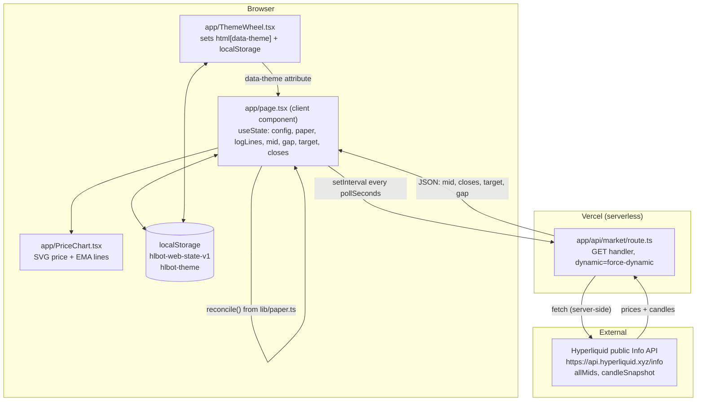

# ARCHITECTURE.md — hyperliquid-bot-web

All content **Verified** by direct source inspection at commit `7df08aa` unless marked otherwise.

## System overview

A single Next.js App Router application with exactly one API route and one real page. It has no database, no auth, no persistent server-side state. All "trading" is a client-side simulation driven by live, public, read-only market data fetched through the one API route. The entire point of the system is: **poll real prices → compute a real signal using the same math as a separate Python bot → simulate what a paper account would do → show it, prettily, with a theme picker.**

## Frontend structure

- `app/layout.tsx`: root HTML shell. Contains an inline `<script>` (not a React effect — runs before hydration) that reads `localStorage.getItem("hlbot-theme")` and sets `document.documentElement.setAttribute("data-theme", theme)` immediately, so there's no flash of the wrong theme on load. Defaults to `"dark"` if nothing saved or the saved value isn't one of the 4 known theme keys.
- `app/page.tsx`: the entire application UI. One big client component. Owns all React state (see System overview diagram). No child state — `PriceChart` and `ThemeWheel` are the only child components and each manages its own small local state (chart hover index; theme wheel's own copy of the current theme for the checkmark UI).
- `app/PriceChart.tsx`: pure presentational + a little interaction logic (mouse-move → nearest-candle index → tooltip). Computes EMA series client-side via `lib/strategy.ts`'s `emaSeries()` (a client-safe pure function, no Next-specific code).
- `app/ThemeWheel.tsx`: reads current theme from the DOM on mount (`document.documentElement.getAttribute("data-theme")`), renders 4 swatch buttons, and on click sets both the DOM attribute and `localStorage`.
- `app/changelog/page.tsx`: static server component, no client interactivity, no data fetching. Hardcoded array of version entries.

## Backend structure

Exactly one server-side entry point: `app/api/market/route.ts`. It is a Next.js Route Handler exporting a single `GET` function. No other HTTP methods are handled on this route. `export const dynamic = "force-dynamic"` disables any caching — every request hits Hyperliquid fresh.

There is no other backend. No database layer, no queue, no cron, no webhook receiver.

## Server/client boundaries

- **Server-only:** `lib/hyperliquid.ts` (calls `fetch` against Hyperliquid — this *could* run client-side too since the Hyperliquid API has no auth and presumably allows CORS, but it is deliberately called from the route handler, not the browser, keeping the integration point centralized and swappable).
- **Client-only:** `app/page.tsx`, `app/PriceChart.tsx`, `app/ThemeWheel.tsx` (all `"use client"`).
- **Isomorphic (used both sides):** `lib/strategy.ts` (the route handler uses `signal()` server-side to compute the returned `target`/`gap`; the client independently re-uses `emaSeries()` from the same file purely for drawing the chart — this is intentional duplication-of-import, not duplication-of-logic, since it's the same source file).
- `lib/risk.ts` and `lib/paper.ts` are **client-only in practice** (imported only from `app/page.tsx`), even though nothing about them is React-specific — they could be called server-side too if the architecture ever grows a persistent paper-account backend.

## Request lifecycle (one poll tick)

1. Client timer fires (or user clicks Start, which fires immediately then starts the interval) — `app/page.tsx`'s `tick()`.
2. `fetch('/api/market?symbol=...&interval=...&fast=...&slow=...&band=...', { cache: 'no-store' })`.
3. Route handler parses query params (with defaults), calls `fetchMid()` and `fetchRecentCloses()` from `lib/hyperliquid.ts` **in parallel** via `Promise.all`.
4. Each of those does a `POST` to `https://api.hyperliquid.xyz/info` with a different `type` body (`allMids`, `candleSnapshot`).
5. Route handler computes `signal(closes, fast, slow, band)` from `lib/strategy.ts`.
6. Route handler returns `{ symbol, mid, closes, target, gap, ts }` as JSON (200), or `{ error }` (404 if no mid price found for the symbol, 502 on any thrown error).
7. Client receives the response, updates `mid`/`gap`/`target`/`closes` state.
8. Client calls `reconcile()` from `lib/paper.ts` with the current paper state, the new `mid`, and `target` — this may simulate closing/opening/flipping a paper position, may trip the kill switch, and always recomputes `posUsd`/`equity`/`pnl`.
9. Client appends a formatted line to the activity log.
10. A `useEffect` on `[config, paper, logLines]` persists the whole thing to `localStorage`.

## Data flow

Real market data flows one direction only: Hyperliquid → route handler → client. There is no write path back to Hyperliquid (no order placement) — this is deliberate and load-bearing to the app's safety story (see `CLAUDE.md` → "DO NOT CHANGE WITHOUT REVIEW").

## Authentication flow / Authorization flow

Not applicable — no auth exists anywhere in this app.

## Database access flow

Not applicable — no database.

## Storage flow

`localStorage` only, in the browser, under two keys:
- `hlbot-web-state-v1`: `{ config: Config, paper: PaperState, logLines: LogLine[] }` — read on mount, written on every state change.
- `hlbot-theme`: one of `"dark" | "light" | "matrix" | "violet"` — read by the inline script in `layout.tsx` and by `ThemeWheel.tsx` on mount; written by `ThemeWheel.tsx` on selection.

Nothing is ever sent to any server for storage purposes.

## External API flow

See Request lifecycle above. Single external dependency: Hyperliquid public Info API. No SDK, raw `fetch`, no retries, no backoff, no circuit breaker.

## Real-time communication / multiplayer architecture

Not applicable. "Real-time" here is client polling on a timer, not WebSockets/SSE/multiplayer. There is no shared state between different users' browser sessions — every visitor has their own independent paper account in their own `localStorage`.

## Background jobs / scheduled jobs

None. All periodic behavior is a client-side `setInterval` that only runs while the tab is open and the user has pressed Start.

## Caching

Deliberately disabled at every layer that could cache: the outbound Hyperliquid fetch (`cache: "no-store"`), the route handler (`dynamic = "force-dynamic"`), and the client fetch (`cache: "no-store"`).

## State management

Plain React `useState` in `app/page.tsx`. No Context, no Redux/Zustand/Jotai. `PriceChart` and `ThemeWheel` each hold only their own local UI state.

## Error handling

- Route handler: try/catch around the two upstream calls; returns JSON `{ error }` with an appropriate status.
- Client: `tick()` wraps everything in try/catch; on any thrown error or a non-OK response, an error line (styled red via `.err` class) is appended to the visible activity log. There is no toast/alert system — the log panel *is* the error UI.

## Logging

No structured server-side logging beyond Next.js/Vercel's own function invocation logs (not configured with any custom logger). Client-side "logging" is purely the in-UI activity log, never sent anywhere.

## Deployment architecture

Vercel. The one route handler deploys as a Vercel serverless function (Next.js default for App Router route handlers without an explicit `runtime` export — **Unknown/not verified** whether it runs on the Node.js runtime or Edge runtime by default for this Next.js version; no `export const runtime = ...` is set in the file, so it uses whatever Next 15's default is). Static pages (`/`, `/changelog`) and assets (`public/*.png`, `app/icon.png`) are served via Vercel's static/CDN layer.

## Scaling considerations

Trivial — this is a low-traffic personal dashboard. The only real scaling concern would be Hyperliquid rate-limiting if traffic spiked, which is entirely unhandled (no backoff/retry). Not a concern at current (single-user) usage.

## Security boundaries

There are effectively none to speak of, by design — no secrets, no auth, no user data, no write access to any external system. The only "boundary" worth naming is that the app never sends a private key or credential anywhere, and the `/api/market` route only ever proxies public, read-only data. See `SECURITY.md` for the full review.

## Major architectural risks

1. **No tests.** Any refactor of `lib/strategy.ts`/`lib/risk.ts`/`lib/paper.ts` risks silently breaking the "exact port" guarantee with no automated safety net.
2. **No retry/backoff on the Hyperliquid call.** A transient upstream error just shows as a logged error and the UI stalls until the next poll tick — acceptable for a hobby dashboard, would need hardening for anything more serious.
3. **Theme system is variable-discipline-dependent, not structurally enforced.** Nothing stops a future change from reintroducing a hardcoded color that breaks 3 of the 4 themes invisibly (this happened twice already this session). There is no lint rule or test guarding against it.
